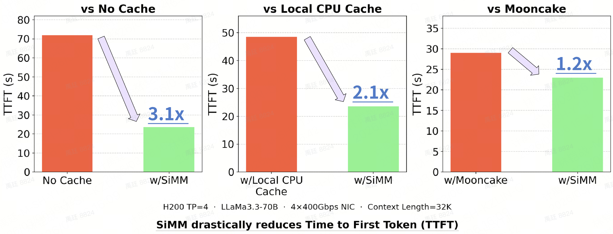
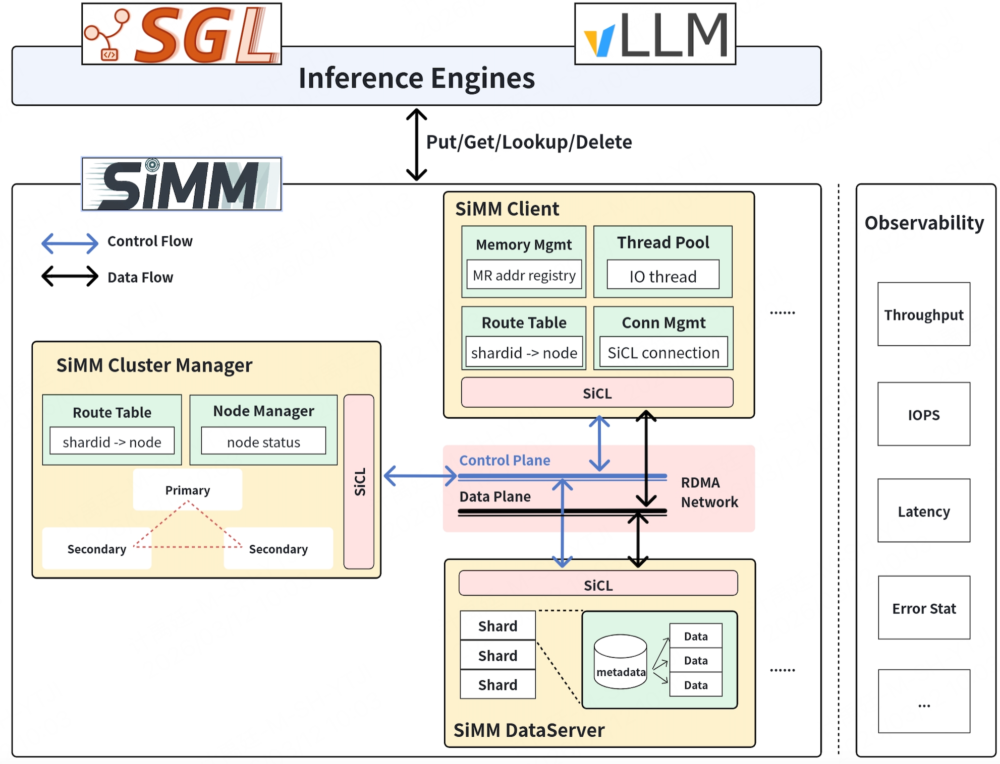
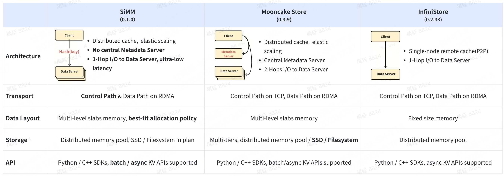
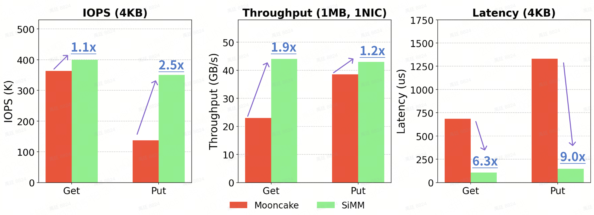
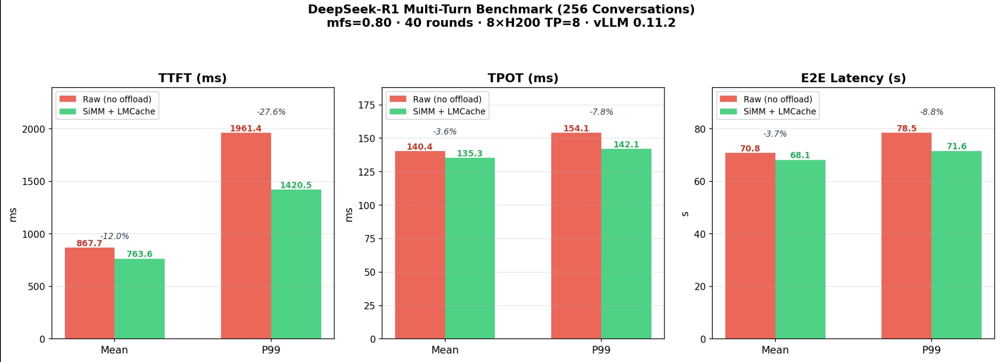
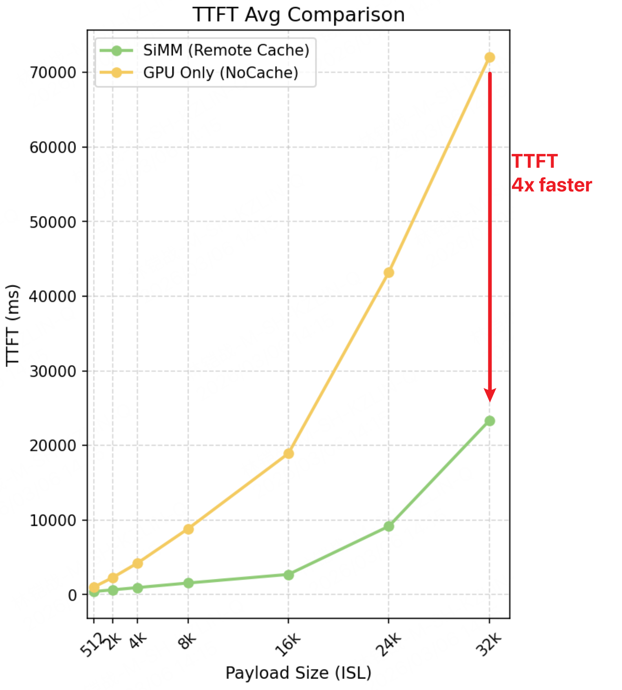
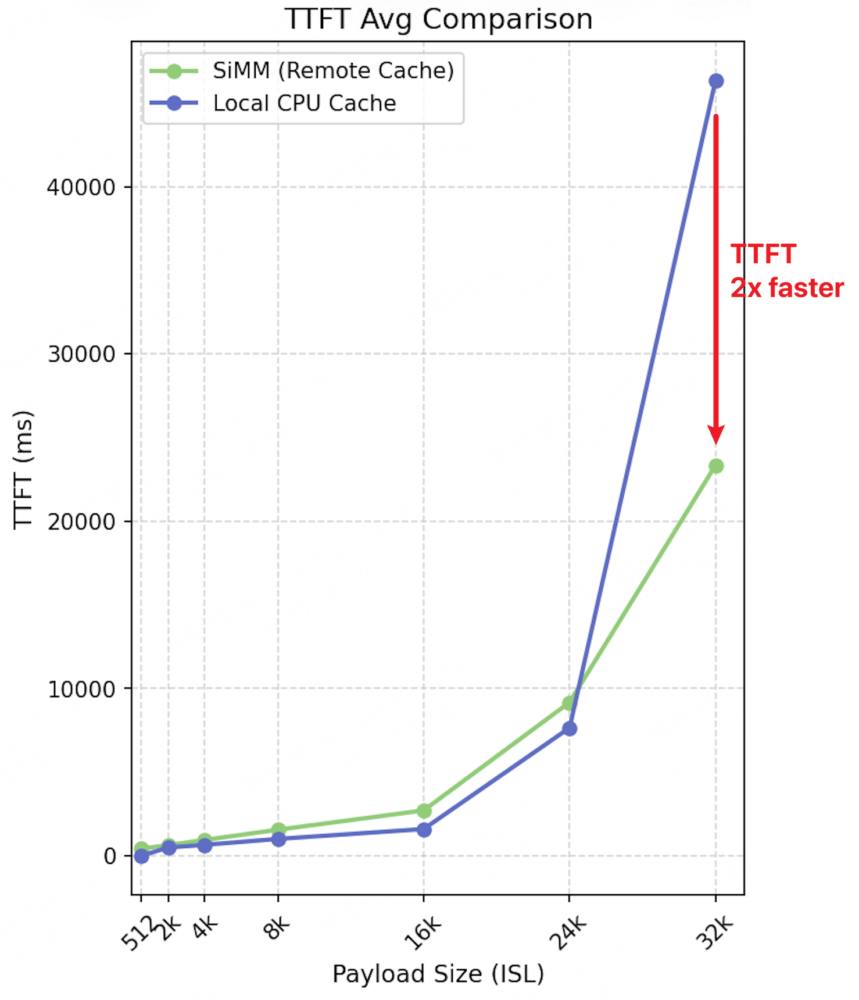
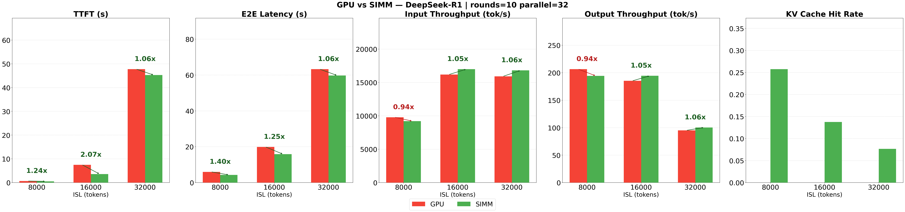
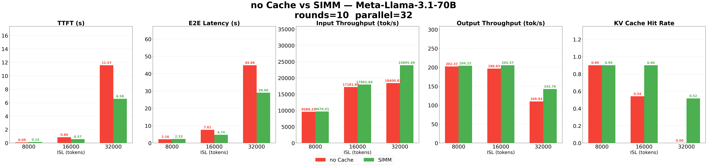
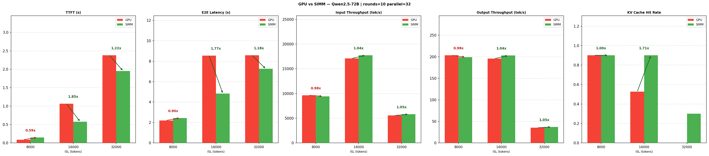

<div align="center">
  
  <h2 align="center">
    Scalable in-Memory Middleware
  </h2>
</div>

## About
**SiMM** is a high-performance, scalable Key-Value (KV) cache engine designed for LLM inference workloads. It addresses the critical bottlenecks in long-context prompts and multi-turn agent interactions by providing a dedicated, fast memory pool for KV cache storage.  
Seamlessly integrated with leading inference engines like SGLang and vLLM, enabling offload and retrieve KV caches from SiMM, inference engines can bypass redundant prefill computations, significantly save GPU cycles and drastically reduce Time to First Token (TTFT). SiMM is already proven and validated in production environments.  

#### Key Features
- **Distributed Architecture**: Provides a massive, multi-node KV cache storage capable of supporting extremely long-context demands
- **Linear Scalability**: Delivers linear growth in both capacity and throughput by horizontally scaling SiMM data servers via one-hop hash based addressing, meeting dynamic KV cache requirements
- **Low Latency**: Reduces KV cache I/O (PUT/GET) latency by up to **9x** compared to industry-leading alternatives through an **end-to-end zero-copy** mechanism and a highly efficient software stack
- **High Bandwidth**: Maximizes I/O bandwidth by fully utilizing **ALL RDMA NICs** of client nodes (effectively eliminating the bottlenecks exposed in [DualPath](https://arxiv.org/abs/2602.21548))
- **Ease of Use**: Offers seamless integration with popular inference engines, with deployment orchestrated via **Kubernetes (K8s)** for production-grade reliability  
  
Under multi-turn long-context LLM workloads with significant KV cache reuse, **SiMM drastically reduces prefill latency (TTFT)** by transforming the prefill phase from a compute-heavy task into a high-speed I/O retrieval operation. Under 32K context length, SiMM achieves **3.1x** speedup over "No Cache" configuration and **2.1x** speedup over local CPU caching, **1.2x** outperforming industry-leading alternatives [[details](#benchmark-with-vllmlmcache)].   
<div align="center">
  
</div>

## Architecture Overview
<div align="center">
  
</div>

| Core Modules    | Description                                                       | Code Open Source  |
| :-------------  | :---------------------------------------------------------------- | :-----------------|
| Cluster Manager | Controller of cluster management, ensures cluster scaling and optimal data distribution, minimum number: 1 | ✅ Yes            |
| Data Server     | Data nodes to host user KVCache and related metadata, minimum number: 1                                    | ✅ Yes            |
| Client          | Lightweight Python/C++ SDK integrated in LLM inference engine to offload and retrieve KV Caches from SiMM  | ✅ Yes            |
| Observability   | Internal observability modules to collect metrics/io_traces and make them visible                          | ✅ Yes            |
| SiCL            | High-performance network transport library on RDMA (IB and RoCEv2)                                         | ⚠️ No (installation package) |

**Cluster Manager**
- Handles node lifecycle and health monitoring by running Node-Join and Heartbeat protocol
- Maintains and propagates Shard-to-Data-Server routing table, allowing efficient data addressing
- Manages cluster scaling, migration tasks to ensure a balanced distribution of data and load (WIP)

**Data Server**
- Manages host CPU memory utilizing shared memory (shm) file formats
- Maintains per-shard KV tables to store data, utilizing key hash values for efficient indexing and querying
- Employs multi-slab designs with best-fit allocation to efficiently store variable-sized KV data
- Supports various KV eviction policies (WIP)

**Client**
- Aggregates small KV cache I/O into batches to maximize transfer bandwidth utilization and minimize per-request overhead
- Enables zero-copy data path by leveraging user-managed Memory Region (MR) buffer
- Integrated fail-fast mechanisms to mitigate tail latency

**Observability**
- Supports metrics collection like throughput, latency, iops, error stat, see usage [[Metrics](src/common/metrics/README.md)]
- Supports trace point injection into any functions in I/O path to help performance profiling, see usage [[I/O Trace](src/common/trace/README.md)]

**SiCL Network Transport Library**
- ⚠️ Not open-sourced, install it by package and use it in shared library way
- Supports RDMA-native RPC and one-sided RDMA semantics
- Zero-copy data transfer for both host and GPU memory
- Supports both busy-polling and event-driven execution modes

### Comparison with industrial-leading platform
<div align="left">
  
</div>

## Performance
### Test Environment
All tests are executed on identical nodes with below configurations:  
- LLM serving node : H200 x 8, 400Gbps x 8 RNICs, 192 CPU Cores, 2TB memory, Ubuntu 22.04, GPU Driver 570.86.15, CUDA 12.9
- SiMM cluster     : Data Server x 3, Cluster Manager x 1, 3TB host memory in total
- Mooncake cluster : Store Server x 3, Master Server x 1, 3TB host memory in total

### KV I/O Performance
**Test Settings**: simm_kvio_bench or mooncake stress_workload_test; 32 threads with sync put/get interfaces for Throughput & IOPS cases 
<div align="left">
  
</div>

### Benchmark with vLLM/LMCache
SiMM is a storage backend of LMCache in vLLM (patch is being prepared to LMCache project).

**Test Settings**: use vllm/benchmark/multi_turn, DeepSeek-R1, TP=8, Random dataset, 40 rounds
<div align="left">
  
</div>

**Test Settings**: LLaMa3.3-70B, TP=4, Random dataset, 2 rounds(Identical input prompts across rounds to ensure a theoretical full cache hit in the second round)
<div align="left">
  
  
</div>

### Benchmark with SGLang/HiCache
SiMM is a storage backend of HiCache in SGLang, [#PR18016](https://github.com/sgl-project/sglang/pull/18016).

**Test Settings**: SGLang v0.5.8, with benchmark/hicache/bench_multiturn.py; rounds=10, parallel=32.

<div align="left">
  
</div>
<div align="left">
  
</div>
<div align="left">
  
</div>

## Launch SiMM Service

### Env Requirements
> ⚠️**IMPORTANT**
> - Strongly recommand to run SiMM modules on Ubuntu 22.04 & 24.04 
> - RDMA Driver & SDK installed, such as Mellanox OFED.
> - Python 3.10, virtual environment is recommended.

### Running in Kubernetes
The easiest way to deploy SiMM into your Kubernetes cluster is to use the Helm Chart. See 
[SiMM helm chart](k8s/simm).

```bash
# build and push SiMM image
bash ./build_docker.sh --registry docker.io --tag simm:latest --py_ver 3.10

# use the image to deploy SiMM
# replicaCount is the data server num, default is 3
helm install simm ./k8s/simm --set image.repository=docker.io/simm:latest --set replicaCount=3
```

### Build with source codes

#### Prepare
```bash
# Clone SiMM codes
git clone https://github.com/Scitix/SiMM simm

# Clone thirdparty submodules
cd simm
git submodule update --init --recursive

# configure env dependency
bash ./configure.sh

# [optinal] if meet failures by script, please try below manual install commands
apt update -y
cd third_party/folly/
sudo ./build/fbcode_builder/getdeps.py install-system-deps --recursive
sudo apt-get install -y libgflags-dev libgoogle-glog-dev libacl1-dev libprotobuf-dev protobuf-compiler libcurl4-openssl-dev libssl-dev
sudo apt-get install -y libboost-all-dev libdouble-conversion-dev
pip install nanobind

# Install SiCL Network Library
# For SiCL is not open-sourced, you shold install it by package and use it in shared library way, just use ./configure.sh to wget and install it automatically.
```

#### Build 
Use ***build.sh*** to build SiMM, script usage:
```bash
./build.sh 
  --mode    : build mode, values including
    release    : release mode, with -O2 optimization
    debug      : debug mode, with -g
    relwithdeb : release mode with debug info 
    minsizerel : creating smallest possible size binaries
  --test    : trigger test codes build under ./tests subdirectory
  --metric  : enable SiMM metrics collection, default off
  --trace   : enable SiMM IO latency tracing, default off
  --clean   : will cleanup binaries in build/{mode}/ subdirectory
  --verbose : print more build logs
```

* Examples
```bash
# build release mode
./build.sh --mode release

# build debug mode
./build.sh --mode debug

# release clean build 
./build.sh --mode release --clean

# build test codes under debug mode
./build.sh --mode debug --test

# print more build logs under debug mode
./build.sh --mode debug --verbose

# enable request metrics collection functionality
./build.sh --mode release --metric

# enable request trace functionality
./build.sh --mode release --trace
```

* Binaries Output Path
```bash
# release mode output
./build/release/bin
./build/release/lib

# debug mode output
./build/debug/bin
./build/debug/lib

# tests binaries output
./build/debug/bin/unit_tests/
./build/release/bin/unit_tests/

# tools binaries output
./build/debug/bin/tools/
./build/release/bin/tools/

# same for debwithdeb / minsizerel mode
```

#### Deploy
Please refer to [Deploy Guide](docs/deploy_guide.md)

## Use SiMM in LLM
### Run in SGLang
SiMM integrates with SGLang through HiCache. For detailed usage instructions, see [SGLang HiCache documentation](https://docs.sglang.io/advanced_features/hicache_best_practices.html)
```bash
python3 -m sglang.launch_server \
  --model deepseek-ai/DeepSeek-R1 \
  --trust-remote-code \
  --tp 8 --mem-fraction-static 0.75 \
  --page-size 64 \
  --enable-hierarchical-cache \
  --hicache-ratio 1.1 \
  --hicache-mem-layout page_first_direct \
  --hicache-io-backend direct \
  --hicache-storage-backend simm \
  --hicache-write-policy write_through \
  --hicache-storage-prefetch-policy timeout \
  --hicache-storage-backend-extra-config '{"manager_address":"127.0.0.1:30001"}' \
  --port 8080
```

### Run in vLLM
SiMM integrates with vLLM through LMCache. For detailed usage instructions, see [LMCache documentation](https://docs.lmcache.ai/index.html).
```bash
LMCACHE_CHUNK_SIZE=64 \
LMCACHE_LOCAL_CPU=True \
LMCACHE_MAX_LOCAL_CPU_SIZE=1024 \
LMCACHE_REMOTE_URL=simm://127.0.0.1:30001/?use_sync=1 \
LMCACHE_EXTRA_CONFIG={"save_chunk_meta":false} \
LMCACHE_NUMA_MODE=auto \
vllm serve Qwen/Qwen2.5-7B-Instruct/ \
   --served-model-name "Qwen/Qwen2.5-7B-Instruct" \
   --seed 42 \
   --max-model-len 16384 \
   --disable-log-requests \
   --enforce-eager \
   -tp 1 \
   --kv-transfer-config '{"kv_connector":"LMCacheConnectorV1", "kv_role":"kv_both"}' \
   --gpu-memory-utilization 0.8
```

## Roadmaps
- [x] Integrate with main-stream LLM inference platforms (SGLang, vLLM)
- [x] Integrate with main-stream KVCache management system (FlexKV [PR](https://github.com/taco-project/FlexKV/pull/115))
- [ ] Support node-level GPU memory pool
- [ ] Support multiple storage tiers (SSD / Remote Filesystem)
- [ ] Support lossless KV compression and sparse KV retrieval

## Documentations
* [Architecture](docs/architecture.md)
* [Deploy Guide](docs/deploy_guide.md)
* [Admin Tool](docs/admin_tool.md)
* [Inference Integration](docs/inference_integration.md)
* [Production Limits](docs/production_limits.md)
* [Observability Functionality](docs/observability_fuctionality.md)
* [FAQ](docs/faq.md)

## Contact us
<a href="https://join.slack.com/share/enQtMTA3NTU5NDU5Nzg1NDctNTA1NTNhNjBkNzE2ZTM0N2I1ZDIyZTJmOTg2YTljOGE2ZjE0Y2FlZTNkMTg5NTQzYTc5ZmM1YTU3YzQzMGExNg" target="_blank"><strong>Slack Channel: simm-open-source</strong></a>   

## License
SiMM is under Apache License v2.0, please see [`LICENSE`](LICENSE) for details