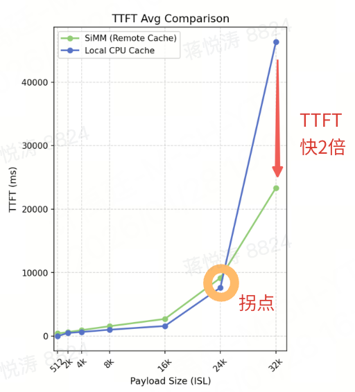

# SiMM: Scitix In-Memory Middleware

## Overview
The SiMM is a distributed, high-performance, elastic cache acceleration layer for all AI workloads.
....

---

## Documentations
* [Architecture](docs/architecture.md)
* [Deploy Guide](docs/deploy_guide.md)
* [Admin Tool](docs/admin_tool.md)
* [Inference Integration](docs/inference_integration.md)
* [Production Limits](docs/production_limits.md)
* [Observability Functionality](docs/observability_fuctionality.md)
* [FAQ](docs/faq.md)

---

---

## Architecture Overview
<div align="center">
  
</div>

SiMM stack consists of below core modules
| Module         | Description                                                       |
| :------------- | :---------------------------------------------------------------- |
| ClusterManager | Cluster-Level central control module                              |
| DataServer     | Data node to store User KV data                                   |
| Client         | Client module running in user-space with application process      |
| SiCL           | High-performance network transport library on RDMA(IB and RoCEv2) |

#### ClusterManager(CM)
As central controller of SiMM Cluster, it play important roles in cluster management: 
- Manager global KV shards-dataserver routing table which help SiMM Clients find the correct dataserver
- Identify dataservers by hand-shake RPC requests
- Detect health status of dataservers by HB RPC requests
- Schedule shards migration plans by different policies and cluster's load (WIP)

#### DataServer(DS)
Data nodes to store all user KV datas, now CPU memory is supported: 
- Use host CPU memory by shm files format
- Per-shard KV table to store KV datas, and searched by key hash value
- Multi-Slab level design to store different KV datas, to import memory utilization 
- Different KV evication policies supported (WIP)

#### Client(CLNT)
- C++ / Python SDKs supported
- Flexible MR buffer management by user application
- Fail-fast mechanism supported to avoid long tail-latency
- Concise implementation to lower CPU/Memroy usage on user hosts

#### SiCL Network Transport Library
High-performance network transport library based on RDMA(IB and RoCEv2):
- ⚠️ Not open-sourced, install it by package and use it in shared library way
- RPC APIs supported
- Zero-copy with MR registration and mempool management
- Epoll and busy-pool modes supported to perceive CQ events
- Large data package auto-split supported to improve throughput
- Request timeout control

## Performance
### C++ SDK Performance
| Test Env | (1 client + 3 dataservers,  hardware are same) | 
| :---------     | :---------      |
| OS  | Ubuntu 22.04(Jammy Jellyfish) |
| NIC | 400Gbps RDMA NIC * 8 | 
| CPU | 192 CPU cores | 
| Mem | 2TB |

| Metrics | OP Setting  | Value |
| :---------     | :---------     | :---------      |
| **Avg Latency** (1 thread) | 4KB Get | 60 us |
|  | 1MB Get  | 202 us |
|  | 4KB Put | 73 us |
|  | 1MB Put | 145 us |
|  | lookup | 70 us |
|  | delete | 75 us |
| **IOPS** (32 threads) | 4KB Get | ~400k/s |
|  | 4KB Put | ~350k/s |
|  | lookup | ~430k/s
|  | delete | ~420k/s
| **Throughput** (32 threads) | 1MB Get (binding to 1 NIC) | ~45GB/s |
|  | 1MB Put (binding to 1 NIC) | ~43GB/s |

### Integration with vLLM/LMCache
SiMM can be connected to vLLM as one storage backend by LMCache(patch is being prepared to LMCache project), and provide elastic KVCache to improve inference performance(TTFT/TPOT/TokenThroughput) : 
Test Env & Settings : LLaMa3.3-70B，TP=4，4×400Gbps NIC
- SiMM always outperform to GPU only(HBM) when ISL > 64B, and when ISL > 24KB, TTFT(SiMM) is faster by 4x
<div align="left">
  
</div>

- SiMM outperform to CPU local(CPU memory) when ISL > 24KB, TTFT is faster by 2x
<div align="left">
  
</div>

### Integration with SGLang/HiCache
SiMM is a storage backend of HiCache in SGLang(https://github.com/sgl-project/sglang/pull/18016).

Test Env & Settings :
- DeepSeek R1 on 8*H200, 8x400Gbps NIC
- GPU Driver: 570.86.15, CUDA 12.9
- Use benchmark/hicache/bench_multiturn.py

SiMM always outperform to GPU only.

| rounds | parallel | Req throughput (req/s) | | Input throughput (token/s) | | Output throughput (token/s) | | SLO (ms) | | | |
|--------|----------|------------------------|-|-----------------------------|-|-----------------------------|-|----------|-|-|-|
|        |          | SiMM    | GPU          | SiMM       | GPU         | SiMM       | GPU         | SiMM     |             | GPU      |            |
|        |          |         |              |            |             |            |             | TTFT     | E2E Latency | TTFT     | E2E Latency |
| 3      | 4        | 0.81    | 0.80         | 6856.36    | 6810.02     | 161.14     | 159.83      | 0.43     | 3.20        | 0.50     | 3.45        |
|        | 8        | 0.97    | 0.90         | 8250.51    | 7670.94     | 193.62     | 180.09      | 0.47     | 3.84        | 0.56     | 4.05        |
|        | 16       | 0.97    | 1.02         | 8236.79    | 8653.88     | 193.49     | 203.30      | 0.49     | 3.73        | 0.63     | 4.92        |
| 10     | 4        | 0.88    | 0.80         | 8153.91    | 7767.07     | 168.62     | 160.61      | 0.41     | 3.11        | 0.56     | 3.57        |
|        | 8        | 0.97    | 0.91         | 9353.14    | 8819.79     | 193.55     | 182.40      | 0.43     | 3.65        | 0.66     | 4.51        |
|        | 16       | 1.01    | 0.98         | 9733.29    | 9459.86     | 201.32     | 195.47      | 0.50     | 4.08        | 0.72     | 5.23        |

'GPU' means only use GPU cache (no use hicache).

## Checkout Codes
Clone SiMM repository from GitHub:

	git clone https://github.com/Scitix/SiMM simm

Code of `Scitix/SiMM` will be cloned to your local file system in subdirectory simm/, run the
following commands to check out the submodules:

```bash
cd simm
git submodule update --init --recursive
```

---

## Quick Start

### Before Using SiMM
SiMM is designed and optimized for high-speed RDMA networks (not support TCP-only).

The following needs to be installed before running any component of SiMM:

- RDMA Driver & SDK, such as Mellanox OFED.
- Python 3.10, virtual environment is recommended.

### Running in Kubernetes
The easiest way to deploy SiMM into your Kubernetes cluster is to use the Helm Chart. See 
[SiMM helm chart](k8s/simm).

```bash
# build and push SiMM image
bash ./build_docker.sh --registry docker.io --tag simm:latest --py_ver 3.10

# use the image to deploy SiMM
# replicaCount is the data server num, default is 3
helm install simm ./k8s/simm --set image.repository=docker.io/simm:latest --set replicaCount=3
```

---

## Install Depenencies
Currently, SiMM only support building on Ubuntu plaform and limited to below two versions:
* Ubuntu 22.04
* Ubuntu 24.04

Before building SiMM, it needs to install some dependencies(need ***root*** user) by below two methods:

### Auto Configure
```bash
cd simm
bash ./configure.sh
```

### Manual Bash Commands
If you meet any issues when using configure.sh, try below bash commands
```bash
cd simm
apt update -y

cd third_party/folly/
sudo ./build/fbcode_builder/getdeps.py install-system-deps --recursive

sudo apt-get install -y libgflags-dev libgoogle-glog-dev libacl1-dev libprotobuf-dev protobuf-compiler libcurl4-openssl-dev libssl-dev
sudo apt-get install -y libboost-all-dev libdouble-conversion-dev
pip install nanobind
```

## Install SiCL Network Library
For SiCL is not open-sourced yet, you shold install it by package and use it in shared library way, just use ```./configure.sh``` to wget and install it automatically.

---

## Build
Use ***build.sh*** to build SiMM, script usage:
```bash
./build.sh 
  --mode    : build mode, values including
    release    : release mode, with -O2 optimization
    debug      : debug mode, with -g
    relwithdeb : release mode with debug info 
    minsizerel : creating smallest possible size binaries
  --test    : trigger test codes build under ./tests subdirectory
  --clean   : will cleanup binaries in build/{mode}/ subdirectory
  --verbose : print more build logs
```

* Examples
```bash
# build release mode
./build.sh --mode release

# build debug mode
./build.sh --mode debug

# build release with debug info mode
./build.sh --mode relwithdeb

# release clean build 
./build.sh --mode release --clean

# build test codes under debug mode
./build.sh --mode debug --test

# print more build logs under debug mode
./build.sh --mode debug --verbose

# enable request metrics collection functionality
./build.sh --mode release --metric

# enable request trace functionality
./build.sh --mode release --trace
```

* Build Binaries Output Path
```bash
# release mode output
./build/release/bin
./build/release/lib

# debug mode output
./build/debug/bin
./build/debug/lib

# tests binaries output
./build/debug/bin/unit_tests/
./build/release/bin/unit_tests/

# tools binaries output
./build/debug/bin/tools/
./build/release/bin/tools/

# same for debwithdeb / minsizerel mode
```

---

## Dependency Declaration
SiMM project does not redistribute any third-party system libraries.
Binaries are built locally by users and may statically or dynamically link against system-provided dependencies(e.g. gflags).
Users are responsible for license compliance of their own builds.

---

## License
SiMM is under Apache License v2.0, please see [`LICENSE`](LICENSE) for details