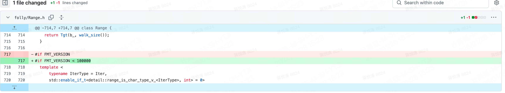

# FAQ
## 1. Build Issues

### 1.1 Folly(fmt)
SiMM built on Folly Codes with tag [v2025.07.07.00](https://github.com/facebook/folly/tree/v2025.07.07.00) defaultly, such release version had fmt lib related build issue, **so you need to patch the fix locally before SiMM build** : 
- git issue : https://github.com/facebook/folly/issues/2468
- mr link : https://github.com/facebook/folly/commit/03ba79afc093424ba73ebe23c8b01a3c39b908ef
<div align="left">
  
</div>

### 1.2 Folly(liburing)
SiMM build maybe fail on Ubuntu 22.04 with liburing dependency(by folly) failure, error message be like:
```bash
Building CXX object third_party/folly/CMakeFiles/folly_base.dir/folly/io/async/DelayedDestruction.cpp.o : 
.../third_party/folly/folly/io/async/AsyncIoUringSocket.cpp: In member function .../third_party/folly/folly/io/async/AsyncIoUringSocket.cpp:682:15: error:
virtual void folly: AsyncIoUringSocket::ReadSqe::callback(const io_uring_cqe* io_uring_zcrx_cqe' does not name a type; did you mean 'io_uring_cqe'?
```
If you meet this issue, please update liburing on your host with below commands:
```bash
# download source codes
git clone https://github.com/axboe/liburing.git path/to/liburing
cd path/to/liburing

# the latest version available is 2.13
git checkout -b v2_13 tags/liburing-2.13

# build & install
./configure --cc=gcc --cxx=g++
make -j
sudo make install
```